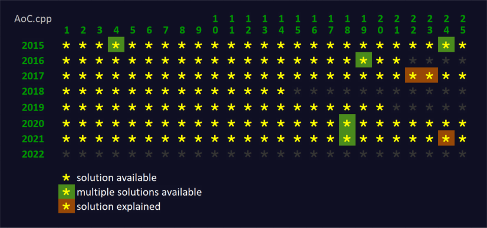

# AoC.cpp
[Advent of Code](http://adventofcode.com) solutions in C++ 11/14/17 (Windows x86/x64, Windows with CUDA x64, Linux x64)

## Features
- Advent of Code 2015-2021 solutions in C++ 11/14/17
- using STL only (in non-CUDA solutions)
- ready to build for Windows x86/x64 in Microsoft Visual Studio Community 2022
- ready to build for Windows x64 with CUDA 11.5 to speed up some solutions on various CUDA architectures
- ready to build for Linux x64 (tested with Ubuntu 20.04)

## Solutions matrix

Current status: 310 AoC stars covered (out of 350★)

## Repository contents
Repository contains the following directories:

Directory | Contents
------------ | -------------
[bin/input](bin/input) | My input of all puzzles.
[bin](bin) | Initially empty, but here you'll find executables after successful build. You can run them from this location, as they read puzzle input from *input* directory by default. Look inside to learn how to run the solutions from command line/bash prompt.
[doc](doc) | Several solutions explained.
[linux](linux) | Contains *CMakeLists.txt* used to build executables in Linux, using *gcc* and *cmake*. Look inside and follow step-by-step recipe to build the code in Ubuntu 20.04.
[sources](sources) | Source files. Review and enjoy.
[windows](windows) | Microsoft Visual Studio Community 2022 solutions and projects configured to easily build executables for Windows. Look inside to learn how to build and debug the code in Windows.
